# Angel Cloud user manual

This manual tells you how to use Angel Cloud: what it is, how to write and ship
an Angel, how to connect an agent, and how to run it day to day. It covers the
*how*. For the *why* behind each design choice, and for what is planned but not
yet built, see the [FAQ](faq.md) — each fact lives in one document only, so
follow the links.

You do not clone this repository to use Angel Cloud. You author an Angel in your
own directory, drive it with the published `@smcllns/angel-core` CLI, and reach
the running Angel over one MCP endpoint. The repository matters only to the
person operating the platform itself ([Operate a deployment](#operate-a-deployment)).

## Contents

1. [What Angel Cloud is](#what-angel-cloud-is)
2. [Milestone 1: what is live](#milestone-1-what-is-live)
3. [Concepts](#concepts)
4. [How a call flows](#how-a-call-flows)
5. [Write an Angel](#write-an-angel)
6. [Add Google custody](#add-google-custody)
7. [Ship it](#ship-it)
8. [Connect an agent](#connect-an-agent)
9. [Use the dashboard](#use-the-dashboard)
10. [Pause and resume](#pause-and-resume)
11. [Errors](#errors)
12. [Operate a deployment](#operate-a-deployment)
13. [Prove it works](#prove-it-works)

## What Angel Cloud is

An **Angel** is a reviewable, statically constrained toolbox: it exposes to an
agent only the operations you allow, with guards on their arguments, and nothing
else. An inbox agent can list and read messages — and cannot send, delete, or
change settings, because those operations do not exist in its toolbox. (An
operation your Connection lacks the Google scope for still deploys, and then
fails at the provider — see [Milestone 1](#milestone-1-what-is-live).)

**Angel Cloud** is the hosted runtime for Angels. You write a short policy file,
build it into an artifact on your machine, and publish that artifact to your
Account. In return you get a stable MCP endpoint plus a bearer Angel key for
each environment (mint more named keys from the dashboard). Every executed tool
call is checked against the same deployed policy by the Gateway, and again by the
Broker before it reaches a provider.

Angel Cloud is the Account-owned hosted platform. It is one of several shapes
this project explores for the same idea; to weigh it against the others, see
[How does Angel Cloud differ from the other shapes?](faq.md#when-should-i-pick-angel-cloud-over-the-other-shapes)

## Milestone 1: what is live

Milestone 1 runs a single pre-provisioned Account, `acct_m1`, behind Cloudflare
Access. As of 2026-07-22 the Broker, Gateway, and Control Workers are deployed
in the dedicated Cloudflare account, and remote CI is green against the public
`@smcllns/angel-core@0.2.0` pin. Provider App `google-primary` is stored
write-only in Broker custody, and its safe summary reads without returning the
client secret.

**Live and proven end to end:**

- The local build, publish, staging deploy, and exact-promotion lifecycle
  ([Ship it](#ship-it)), driven through the Account-scoped management API with
  safely retryable mutations and stable environment keys.
- Bring-your-own Google OAuth custody: a Provider App stored write-only, Google
  consent, and Connection reauthorize, revoke, and remove
  ([Add Google custody](#add-google-custody)).
- Real pinned Google adapters for **`gmail.users.messages.list`** and
  **`docs.documents.get`**. A credentialed run passed both reads, failed loudly
  after a revoke, and passed again after reauthorizing the same Connection.
- The authenticated MCP surface — initialize, tool discovery, tool calls, and
  Connection selection. The Gateway serves initialize and discovery on its own;
  every executed tool call is then checked independently by Gateway and Broker.
- A private dashboard for Angels, Versions, Connections, Provider Apps, keys,
  activity, and pause/resume.

**Not built in this slice:** public signup, Account switching, teams, a
platform-owned Google OAuth app, provider operations outside the reviewed
adapter registry, and production multi-tenancy. What an Angel can reach is
bounded twice: the registry must be able to derive the operation, and the
Connection must already hold the Google scope it needs. An operation that clears
the first bar but not the second publishes and deploys, then fails at Google.
The consent set is fixed in the Control worker for now
([which scopes](faq.md#which-google-scopes-are-requested)). For the full list,
see [what is not built yet](faq.md#what-is-not-built-yet).

The Google OAuth client is still in External Testing, whose refresh tokens
expire after seven days, so scheduled monitoring is not yet durable.

## Concepts

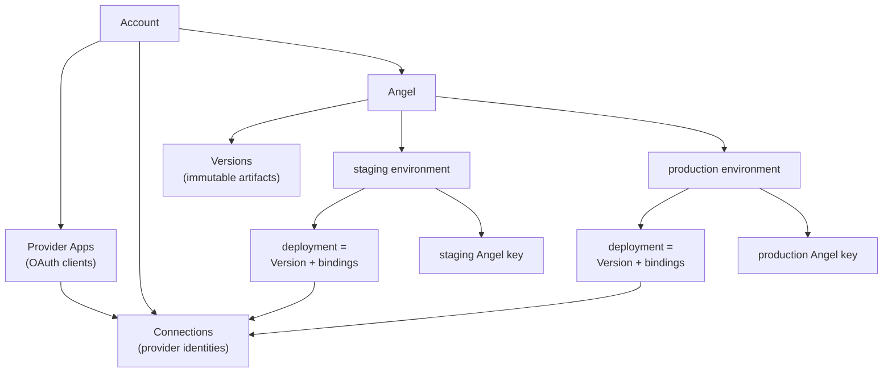

- **Account** — the ownership and isolation boundary. It owns everything below.
  A request for another Account's resources returns `404`
  ([why not a denial?](faq.md#how-are-accounts-isolated)).
- **Provider App** — one reusable OAuth client ID and secret you bring yourself.
  It is stored write-only in Broker custody; its secret is never read back.
- **Connection** — an Account-owned link to one authorized provider identity and
  its refresh grant, such as "Personal Google". You give a Connection a nickname
  when you authorize it, and reference that nickname in your local `angel.json`;
  agents never see it — see [Choose a Connection](#choose-a-connection).
- **Angel** — a named policy unit inside an Account, addressed by slug. It has
  two environments and a list of Versions.
- **Version** — a published policy artifact, addressed by the SHA-256 digest of
  its canonical source. Versions never change; publishing the same digest twice
  returns the existing Version
  ([why](faq.md#why-are-versions-immutable)).
- **Environment** — `staging` or `production`, nothing else. Each has its own
  deployment, bindings, availability state, and Angel key. A staging key cannot
  call production.
- **Deployment** — one Version installed into one environment, with explicit
  **bindings** that map each of the artifact's requirements to Connections.
- **Angel key** — the bearer an agent presents. Each environment gets a default
  key, shown once at first publish and stable across new Versions; you can mint
  more named keys, rotate, and revoke them from the dashboard. The server keeps
  only a hash and short fingerprint of each
  ([can I rotate?](faq.md#can-i-rotate-an-angel-key-is-it-shown-more-than-once)).
- **Availability overlay** — runtime pause/resume state layered over a
  deployment. It can only switch off tools the deployment already has; it can
  never add authority.
- **Gate receipt** — a hash-chained record each gate writes for every decision.
  A call that reaches the Broker yields two receipts, and the platform refuses it
  unless they agree.

Provider Apps and Connections belong to the Account, not to an Angel. One Google
OAuth client can authorize several identities, and one Connection can serve
several Angels.

## How a call flows

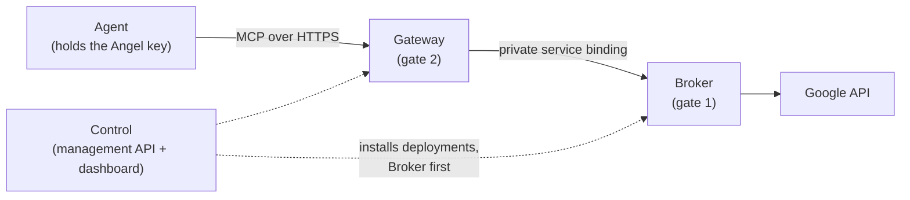

Three Cloudflare Workers share the work:

- **Control** owns the Account, the management API, Versions, deployments, key
  hashes, and the dashboard's read model. It sits outside the call path.
- **Gateway** serves the public MCP endpoint. It verifies your Angel key, then
  evaluates the deployed allowlist, argument guards, Connection selection, and
  availability in its own Durable Object.
- **Broker** has no public route; only service bindings reach it. It holds an
  independent copy of the same deployment, leases the Connection's credential,
  evaluates the call again from scratch, and only then invokes Google. It does
  not trust the Gateway.

One call, step by step:

1. The agent POSTs a `tools/call` to the Gateway with its Angel key.
2. The Gateway hashes the key and compares it, timing-safe, against the stored
   hash. Wrong key: `401`.
3. The Gateway's gate evaluates the call and writes a receipt. A denial goes
   straight back to the agent with the reason.
4. On allow, the Gateway forwards the call to the Broker along with the identity
   fields of its receipt: deployment ID, version, policy digest, bindings digest,
   availability digest, tool, and Connection ref.
5. The Broker's gate evaluates the same call independently and writes its own
   receipt. If its result disagrees with what the Gateway expected, the call
   fails — the agent sees `-32603`.
6. On agreement, the Broker leases the credential, calls Google, and the result
   flows back. The response carries both receipts, redacted for the agent, in
   `_meta`.

Why two gates in one Cloudflare account, and what that does and does not protect:
see [Why two gates?](faq.md#why-two-gates-at-all-if-both-run-in-the-same-cloudflare-account)

## Write an Angel

An Angel is normally two files in `angels/<slug>/`:

- `ANGEL.yaml` — portable policy. What the toolbox contains. No target, no
  Account, no credentials, no nicknames.
- `angel.json` — local deployment config. Where to publish and which Connections
  to bind. Keep the real file out of git if your nicknames are private; commit a
  safe `angel.example.json`.

Why the split matters: see
[What's the difference between ANGEL.yaml and angel.json?](faq.md#whats-the-difference-between-angelyaml-and-angeljson)

### ANGEL.yaml

Three top-level keys:

- `name` — required. A lowercase slug (`^[a-z0-9][a-z0-9-]*$`) that must equal
  the folder name.
- `charter` — optional free text describing intent. The charter is never
  enforced; only `tools` and their guards are.
- Exactly one of `tools` or `angels` — never both, never neither.

**Direct form** (`tools:`). Each entry is a canonical operation name, or a
mapping with `tool` and optional `argGuards`:

```yaml
name: google-read-proof
charter: Read bounded Gmail search results and one requested Google Doc. Never create, edit, send, or delete.

tools:
  - tool: gmail.users.messages.list
    argGuards:
      - field: maxResults
        pin: "5"
  - docs.documents.get
```

The prefix before the first `.` picks the provider adapter. Two adapters exist,
both using Google OAuth: `docs` (`docs.documents.get`) and `gmail` (a catalog
spanning messages, drafts, labels, threads, history, attachments, and read-only
settings). The build rejects duplicate tools.

The executable surface is the reviewed adapter registry shipped with
`@smcllns/angel-core`: every artifact tool carries a request template derived
from a reviewed provider spec, publish rejects any operation the registry
cannot derive, and the Broker executes exactly the sealed template. One
boundary remains: the hosted consent flow still requests read-only Google
scopes, so a write Angel publishes but its deployment is rejected until a
Connection grants every required scope — expanding the consent surface is the
next step.

### Argument guards

Each guard names a `field` and exactly one rule:

- `pin: "<value>"` — the field is forced to this value.
- `forbid: true` — the field may not appear at all.
- `forbiddenValues: [A, B]` — the gate rejects these values; it upper-cases and
  de-duplicates the list first.

Example from the checked-in `gmail-inbox-zero` Angel: `messages.modify` and
`threads.modify` are allowed, but `addLabelIds` and `removeLabelIds` both carry
`forbiddenValues: [TRASH, SPAM, SENT]` — a policy that lets the agent relabel and
archive but never trash, spam, or fake a send. This illustrates guard semantics;
in Milestone 1 only the two read operations above reach real Google, so a
`modify` call fails closed at the provider. The field `angel_connection` is
reserved by the platform; you cannot declare or guard it
([why](faq.md#can-i-declare-or-guard-angel_connection-in-my-own-policy)).

### Composing Angels

**Composed form** (`angels:`) names sibling Angels instead of tools:

```yaml
name: golden-assistant
charter: Research Gmail and Google Docs and prepare Gmail drafts for review.

angels:
  - gmail-read-and-draft
  - gdocs-read
```

The build loads each child from `angels/<name>/ANGEL.yaml`, compiles it, and
seals the child's exact digest into the parent artifact. Child tools are
flattened; the same tool in two children is a build error, as are cycles. When to
compose rather than list tools directly: see
[the FAQ](faq.md#when-do-i-need-composition).

### angel.json

Exactly four keys:

```json
{
  "target": "https://angelmcp-control-demo.sam-633.workers.dev",
  "account": "acct_m1",
  "angel": "google-read-proof",
  "bindings": {
    "staging":    { "gmail": "proof-google", "docs": "proof-google" },
    "production": { "gmail": "proof-google", "docs": "proof-google" }
  }
}
```

- `target` — the HTTPS origin of the Control Worker. No path, query, or
  credentials.
- `account` — your Account ID.
- `angel` — the Angel slug; must equal the artifact's `name`.
- `bindings` — a `staging` map and a `production` map, each keyed by the
  artifact's binding-requirement IDs. For a direct Angel the ID is the provider
  name (`gmail`); for a composed Angel it is the child name
  (`gmail-read-and-draft`), or `<child>:<provider>` when one child uses two
  providers. The value is one Connection nickname, or a list of nicknames to give
  the agent a choice. Production never inherits staging's bindings
  ([why](faq.md#why-cant-production-reuse-my-staging-bindings-automatically)).

## Add Google custody

Before you can bind an Angel, the Account needs a healthy Google Connection.
Custody is set up once, in the browser: open the deployed Control www URL and
complete **Cloudflare account login** (the interactive identity provider is not
one-time PIN). The browser uses its Access session; no management bearer belongs
in the page. There is no headless API for this step.

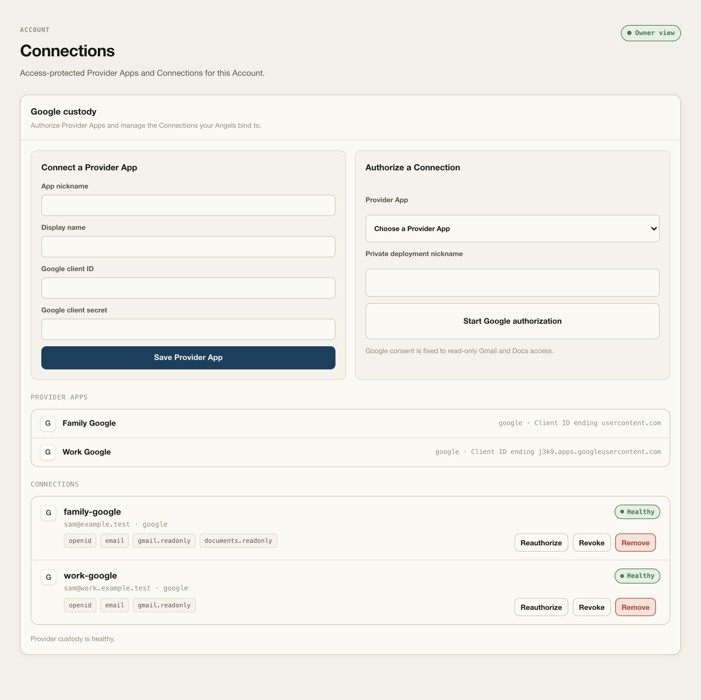

### Save a Provider App

On the **Connections** page, under **Google custody**, add a private app
nickname, a display name, and your Google OAuth client ID and secret. Configure
the deployed `/oauth/google/callback` URL on that Google OAuth client. Angel
Cloud requests a fixed read-only grant for identity, Gmail, and Docs.

The Provider App list exposes its display name, provider, and client-ID suffix.
It never returns the stored client secret — a stored Provider App keeps its
client secret write-only, and its safe summary reads without leaking it.

### Authorize a Connection

Choose the Provider App, enter a private Connection nickname, and start
authorization. Complete Google consent in the same Access-authenticated browser
flow. The callback binds the grant to the Account, Access subject, Provider App,
Connection, nickname, and fixed redirect URI. A healthy Connection shows its
provider-derived identity label and granted scopes.

The management nickname is for you and `angel.json`; agents never see it. They
see a provider-derived label such as `gmail - Google identity` plus an opaque
deployment-scoped selector.

### Manage a Connection

Each Connection row shows its nickname, provider identity, health pill, and
granted-scope chips, with row-level actions:

- **Reauthorize** the same Connection;
- **Revoke** its provider grant; or
- **Remove** the Connection from Angel Cloud.

Reauthorization preserves the Provider App, Google subject, and nickname; it
returns the same Connection to `healthy` rather than creating a new row. An
authorization refresh failure — a Google `401` or `invalid_grant` — marks the
Connection `error`, and only `healthy` Connections can satisfy a new deployment. Provider App removal is not implemented in Milestone 1;
the API returns `501`.

### Provider management HTTP surface

Control verifies Cloudflare Access before serving the www assets or provider
routes. The browser uses these Account-scoped endpoints:

| Method and path | Purpose |
| --- | --- |
| `GET /api/provider-apps` | List safe Provider App summaries. |
| `POST /api/provider-apps` | Store a bring-your-own OAuth client. |
| `DELETE /api/provider-apps/:id` | Reserved; returns `501` in Milestone 1. |
| `GET /api/connections` | List reconciled Connection summaries. |
| `POST /api/connections/authorize` | Start a new Google authorization. |
| `GET /api/connections/:id` | Read one selected Connection. |
| `POST /api/connections/:id/reauthorize` | Reauthorize the same Connection. |
| `POST /api/connections/:id/revoke` | Revoke its Google grant. |
| `DELETE /api/connections/:id` | Revoke if needed, then remove it. |
| `GET /oauth/google/callback` | Finish the bound PKCE flow. |

The CLI's strict `/v1` management resource API requires the same Access identity
plus `Authorization: Bearer <ANGEL_MANAGEMENT_TOKEN>`.

### Credential boundary

The browser sends OAuth client material to the Access-protected Control route,
which passes it to Broker custody. Provider App secrets and Connection refresh
tokens are envelope-encrypted per Account in the Broker's vault. The Broker alone
holds `CREDENTIAL_KEK`, unwraps the Account data key, leases the secret
internally, refreshes a Google access token, and calls a pinned adapter. Control
handles that client material only transiently in the custody request and never
persists or custodies it; the Gateway never receives provider secrets at all.
Both receive summaries, not stored credentials.

## Ship it

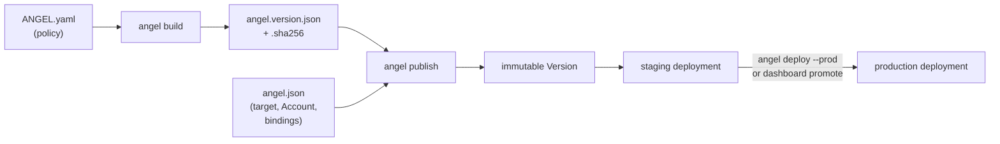

### Install the CLI

The CLI ships as the published npm package `@smcllns/angel-core` (bin `angel`),
and runs under [Bun](https://bun.sh). In your own project directory — **not** a
clone of this repository — install it and invoke it with `pnpm exec angel`:

```sh
pnpm add @smcllns/angel-core
```

It has exactly three subcommands:

```text
pnpm exec angel build   <angel>
pnpm exec angel publish <angel>
pnpm exec angel deploy  <angel> --prod
```

Publish and deploy read two environment variables:

- `ANGEL_MANAGEMENT_TOKEN` — the Control management bearer.
- `ANGEL_ACCESS_TOKEN` — a Cloudflare Access service token, opaque JSON with
  exactly `cf-access-client-id` and `cf-access-client-secret`. The CLI splits it
  into the standard `CF-Access-Client-Id` / `CF-Access-Client-Secret` headers.

Keep both out of source, `angel.json`, logs, and any artifact.

### Build locally

```sh
pnpm exec angel build google-read-proof
```

Local only — no network, no token. It compiles `ANGEL.yaml` (resolving composed
children) and writes `build/angel.version.json` (the canonical, secret-free
artifact) and `build/angel.version.sha256` (its digest). You never need to run
`build` by hand — `publish` runs it — but it is a cheap, offline preview.

### Publish to staging

```sh
ANGEL_MANAGEMENT_TOKEN=... \
ANGEL_ACCESS_TOKEN='{"cf-access-client-id":"...","cf-access-client-secret":"..."}' \
pnpm exec angel publish google-read-proof
```

One command does four things:

1. Builds the artifact.
2. Ensures the Angel exists under your Account. **On first creation the response
   carries both plaintext environment keys and the CLI prints them — save them
   now. The server stores only a SHA-256 hash and a short fingerprint; no API can
   read the plaintext back**
   ([can I rotate?](faq.md#can-i-rotate-an-angel-key-is-it-shown-more-than-once)).
3. Publishes the Version. The same digest returns the same Version.
4. Deploys it to staging, resolving your `staging` binding nicknames against the
   Account's live Connections. Each nickname must exist, be `healthy`, and cover
   its requirement's provider.

Every mutation carries an idempotency key: resend the same key to retry a call
safely, and never reuse a key for different input.

### Promote the exact staged deployment

```sh
ANGEL_MANAGEMENT_TOKEN=... \
ANGEL_ACCESS_TOKEN='{"cf-access-client-id":"...","cf-access-client-secret":"..."}' \
pnpm exec angel deploy google-read-proof --prod
```

Promotion, not deployment from source. It reads the *currently active* staging
deployment, resolves your `production` binding nicknames, and asks Control to
promote that exact staged Version and digest under your production bindings. It
does not build, publish, or pick a newer Version — the policy you tested on
staging is byte-for-byte what production runs, though each environment keeps its
own bindings. The
dashboard's promote button does the same thing, with a drift check on top
([the Activity pane](#use-the-dashboard)). Rollback has no command yet; see
[How do I roll back?](faq.md#how-do-i-roll-back)

## Connect an agent

### Endpoint and auth

Each Angel environment has one MCP endpoint on the Gateway:

```text
POST https://<gateway>/v1/a/<account>/<angel>/<staging|production>/mcp
Authorization: Bearer <that environment's Angel key>
```

Today `<gateway>` is `angelmcp-gateway-demo.sam-633.workers.dev`. The endpoint
serves only POST; other methods get `405`.

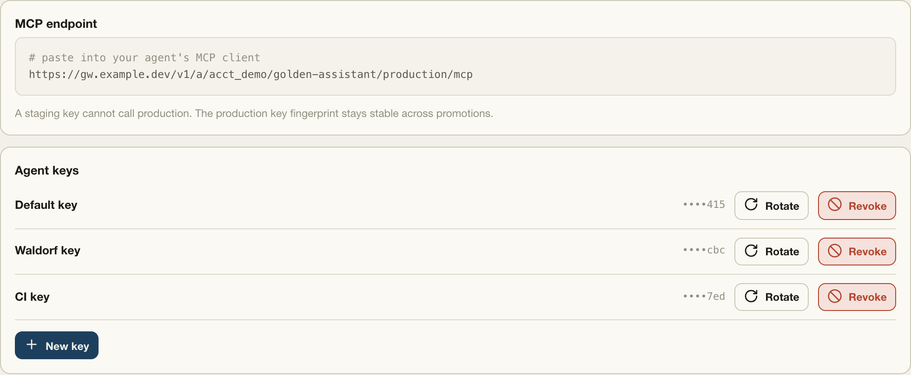

### Protocol

The endpoint speaks MCP streamable HTTP (JSON-RPC over POST), protocol version
`2025-06-18`. Four methods: `initialize`, `notifications/initialized`,
`tools/list`, `tools/call`. Per request:

- `Accept` must include both `application/json` and `text/event-stream`.
- `Content-Type: application/json`.
- After `initialize`, send `MCP-Protocol-Version: 2025-06-18` on every request.
- If you send `Origin`, it must match the endpoint origin.

### Discover tools

`tools/list` needs authentication and returns one definition per deployed tool
that has at least one enabled Connection. Paused tools simply do not appear. Each
definition names the canonical operation (`gmail.users.messages.list`) — tools
are never renamed or duplicated per Connection.

### Choose a Connection

When a tool is bound to more than one Connection, its input schema gains a
required string argument `angel_connection` with one choice per Connection: the
value is an opaque ref (`arc_...`) and the title is a human label such as
`gmail - Google identity`. With a single Connection you may omit the argument.
With several, omitting it fails with `connection_required` — the platform never
fans a call out to all Connections
([why](faq.md#what-happens-if-my-agent-omits-angel_connection)).

The refs are minted fresh for each deployment. Do not cache them across deploys;
refresh `tools/list` instead. Your nicknames, Connection IDs, and credentials
never appear to the agent.

### Read the results

A successful `tools/call` returns the provider result in `structuredContent`, the
same JSON as text in `content`, and `_meta` holding the request ID plus both gate
receipts, redacted for agents. Response headers include `x-angel-policy-digest`
and `x-angel-version`, so you always know which policy served you.

A policy denial is not an HTTP error: you get `200` with `isError: true`, the
reason and detail in `structuredContent.denial`, and the receipts. The reasons
are listed under [Errors](#errors).

## Use the dashboard

The Access-protected www dashboard has three top-level screens: **Home**,
**Angels**, and **Connections**.

**Home** opens with the Account name, a one-line summary, and a health row that
turns loud when any Angel needs attention. An icon-only toggle switches between
three densities: Quiet status rows, a List table, and Dashboard cards. With no
Angels deployed, Home shows a CLI getting-started guide.

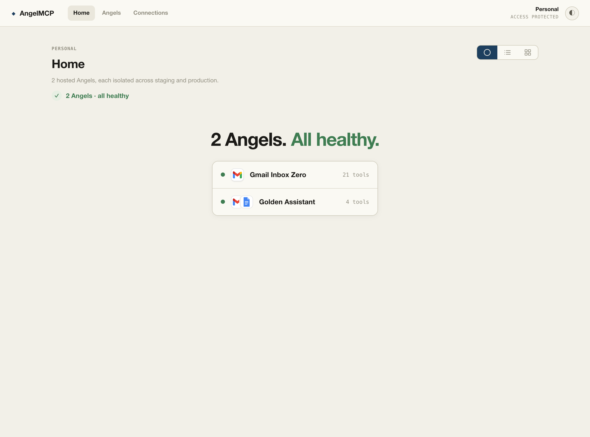

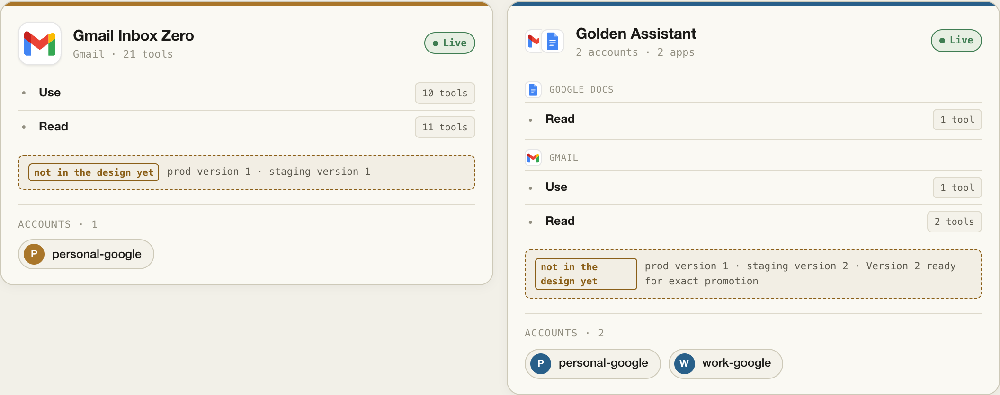

**Connections** owns Google custody: the Provider App and Connection forms and
rows described in [Add Google custody](#add-google-custody).

**Angels** shows one Angel beside a rail of the Account's Angels. The header
carries provider marks, a generated provider summary line (derived from the
active environment's deployed tools, not the `ANGEL.yaml` charter), and the
environment's Version line, with a Staging/Production toggle and a Live/Paused
pill.

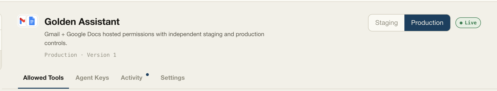

Angel detail has four panes:

- **Allowed Tools** folders the deployed tools into provider-and-Connection cards
  by app and group, with a read-only badge for fully read-only providers. Guarded
  tools expand to their argument-guard lines, and each tool and Connection row has
  an availability toggle.
- **Agent Keys** shows the active environment's MCP endpoint and its named keys as
  `••••` plus last-three fingerprints, with New key, Rotate, and Revoke. Minting
  or rotating reveals the plaintext exactly once, beside the only Copy control;
  the last active key cannot be revoked.
- **Activity** pins a "Needs decision" card for an exact promotion or a pending
  gate repair, then shows the deploy and Version lifecycle and the request feed
  with its gate receipts (a call the Gateway denies never reaches the Broker, so
  it carries no Broker receipt).
- **Settings** holds Availability — environment-scoped **Pause all** and
  **Resume all** — and the immutable Version history with each Version's full
  `sha256` digest.

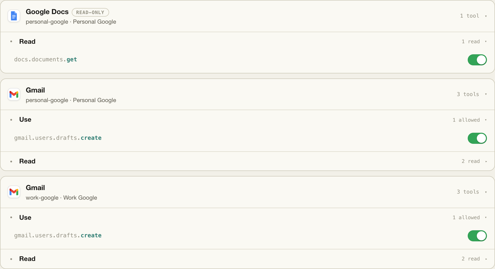

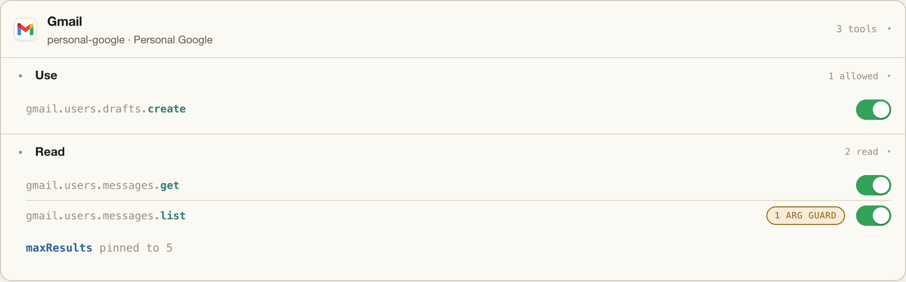

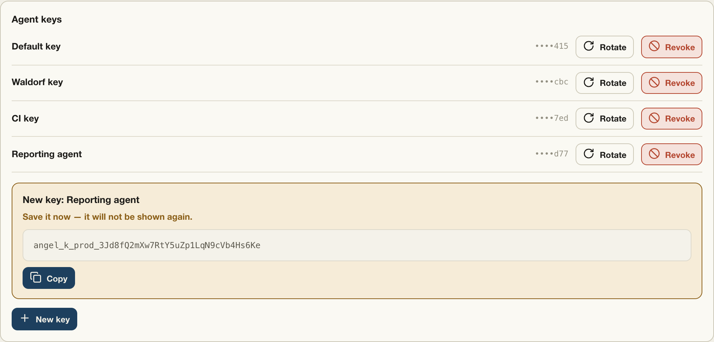

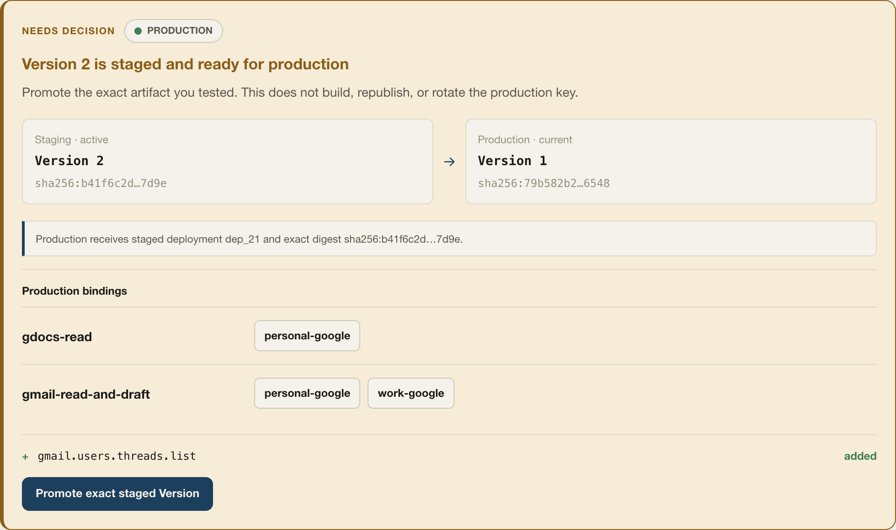

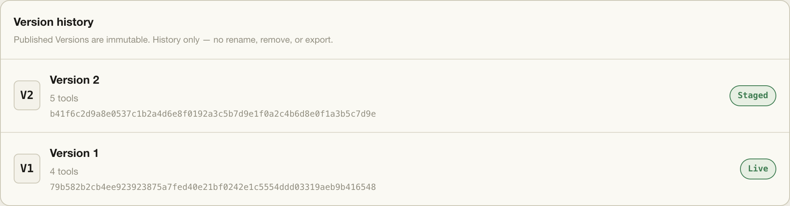

The endpoint comes from the management read model; the page never constructs one.
The web UI does not author, build, or publish policy — those actions stay in
reviewable source and the CLI
([why](faq.md#can-i-author-or-publish-an-angel-from-the-web-ui)).

## Pause and resume

Availability is a runtime overlay per Angel per environment, at three levels:

- **all** — the whole environment;
- **tool** — one tool across all its Connections; or
- **tool + Connection** — one tuple, leaving the tool's other Connections running.

The most specific override wins. Pause state survives a redeploy: tool-level
pauses are pruned to the tools that still exist, and per-Connection pauses
follow the Connection onto the new deployment — a pause is dropped only when
its Connection is no longer bound to the tool. Per-tool-and-Connection toggles
live on the Allowed Tools pane; environment-wide **Pause all** and **Resume all**
live under Settings → Availability.

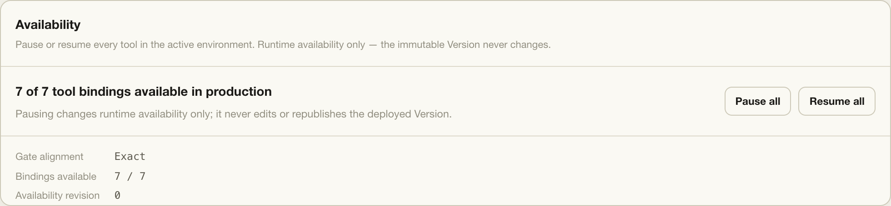

Paused tools disappear from `tools/list` when no active Connection remains; a
direct call returns `tool_paused` or `connection_paused`. Pause is a last-mile,
reversible control. To remove authority for good, edit `ANGEL.yaml`, publish a
new Version, and promote it.

Deploy and availability changes install Broker first and Gateway second. An
interrupted change leaves a repair marker: retry the *identical* request; a
different mutation returns `409` until repair completes.

## Errors

Agent-facing denials arrive as HTTP `200` with `isError: true` and a reason in
`structuredContent.denial.reason`:

| Reason | Meaning |
|---|---|
| `unknown_tool` | The operation is absent from the deployed policy. |
| `connection_required` | More than one Connection is eligible and `angel_connection` was omitted. |
| `connection_unavailable` | The selector is stale, unknown, or unbound. |
| `connection_paused` | That tool and Connection tuple is paused. |
| `tool_paused` | The tool has no active Connection. |
| `guard_denied` | An argument guard rejected the call. |

Transport and platform errors:

| Status | Cause |
|---|---|
| `401` | Missing Access identity on Control, or a missing/wrong Angel key on MCP — including an in-gate `unauthorized` key re-check (`-32001`). |
| `404` | The route or owned resource is absent — cross-Account lookups also return `404`. |
| `405` | Non-POST to the MCP endpoint. |
| `406` / `415` | Wrong `Accept` / `Content-Type`. |
| `403` | Disallowed `Origin`. |
| `400` | Bad JSON, a missing or blank `MCP-Protocol-Version`, an empty `Idempotency-Key`, or invalid management input. |
| `409` | Digest, idempotency, staging, revision, or pending-repair conflict. |
| `-32603` | Gateway and Broker failed to converge — the call was refused. |
| `-32003` | A provider or custody failure (for example a revoked Connection's refresh) surfaced as a JSON-RPC error — distinct from the `-32603` convergence failure. `-32001` is a bad Angel key. |
| `501` | Provider App removal is not implemented. |

Management errors share one shape: `{"error":"<message>"}` with the HTTP status.
Provider and custody failures throw; the runtime never silently substitutes a
fixture response.

## Operate a deployment

This section is for the person running the platform, and it does use this
repository. Deploy the three Workers in dependency order, because each later
Worker service-binds the earlier ones:

```sh
bun run wrangler deploy --config wrangler.broker.jsonc
bun run wrangler deploy --config wrangler.gateway.jsonc
bun run wrangler deploy --config wrangler.control.jsonc
```

Required secrets:

- Broker: `CONTROL_BROKER_TOKEN`, `GATEWAY_BROKER_INVOKE_TOKEN`, `CREDENTIAL_KEK`.
- Gateway: `CONTROL_GATEWAY_TOKEN`, `GATEWAY_BROKER_INVOKE_TOKEN`.
- Control: `CONTROL_GATEWAY_TOKEN`, `CONTROL_BROKER_TOKEN`,
  `MANAGEMENT_API_TOKEN`, `CONTROL_RESPONSE_KEK`, `DEMO_ADMIN_TOKEN`.

Required Control variables are `ACCOUNT_ID`, `ACCESS_TEAM_DOMAIN`,
`ACCESS_AUDIENCE`, `CONTROL_BASE_URL`, and `GATEWAY_BASE_URL`. The internal tokens
must be non-empty and pairwise distinct; every Worker fails closed otherwise. The
Broker has `workers_dev` disabled and no public route.

## Prove it works

### Deterministic CI

```sh
bun run check
```

The ordinary golden journey injects a deterministic provider at the Broker
boundary. It needs no Google or Cloudflare credentials, yet exercises the real
CLI, artifact digests, the Account API, both gates, MCP auth, Connection
selection, availability, exact promotion, key stability, and Account isolation.
The hosted repo runs this against the public `@smcllns/angel-core@0.2.0` pin, and
remote CI is green.

### Full deployed comparison journey

The operator-only `bun run test:golden` journey mutates deployed comparison
Angels and needs `GOLDEN_CONTROL_URL`, `GOLDEN_GATEWAY_URL`,
`GOLDEN_MANAGEMENT_TOKEN`, `GOLDEN_ADMIN_TOKEN`, and `GOLDEN_ACCESS_TOKEN` (the
same two-key JSON format as the CLI variable).

### Real Google acceptance

Once the test Connection is authorized, the separate
`bun run test:google-read-proof` journey receives only `GOLDEN_GATEWAY_URL` (the
exact full production MCP endpoint), `GOLDEN_ANGEL_KEY`, `GOLDEN_GMAIL_QUERY`, and
`GOLDEN_DOC_ID` — no Access, management, Google, or OAuth credential. Follow the
[Google read proof operator journey](google-read-proof-manual-journey.md) for the
pass, revoke, fail, reauthorize, pass lifecycle. Why the standard run is
credential-free by design:
[see the FAQ](faq.md#does-ordinary-ci-call-real-google-isnt-that-just-mocking).

The M1 merge put this workflow on the default branch, so its GitHub Actions
schedule and `workflow_dispatch` run; durable monitoring still waits on a
Production OAuth app (External Testing refresh tokens expire after seven days).
